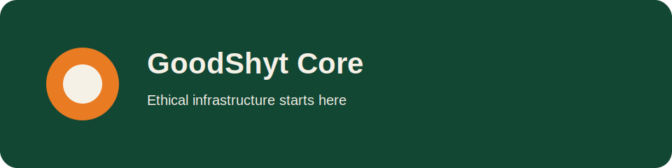

# GoodShyt Core



Canonical ethics, metrics, protocol, and CLI foundation for the GoodShyt Group ecosystem.

## Brand line
**Ethical Infrastructure Starts Here**

## Features
- ECTI, STL, CSM, KAQ scoring
- GoodShyt Moral Index aggregation
- policy loading and validation
- service handshake verification
- FastAPI service and Typer CLI

## Quickstart
```bash
pip install -e .[dev]
uvicorn goodshyt_core.api:app --reload
python -m goodshyt_core.cli score --ecti 0.98 --csm 0.88 --stl 0.10 --kaq 0.84
```

## Visual assets
- `assets/logos/primary.svg`
- `assets/logos/mark-dark.svg`
- `assets/covers/repo-cover.svg`

**Architected by Deonte Watts**  
**GoodShyt Group**  
*Ethical Infrastructure for Human and Community Flourishing*
